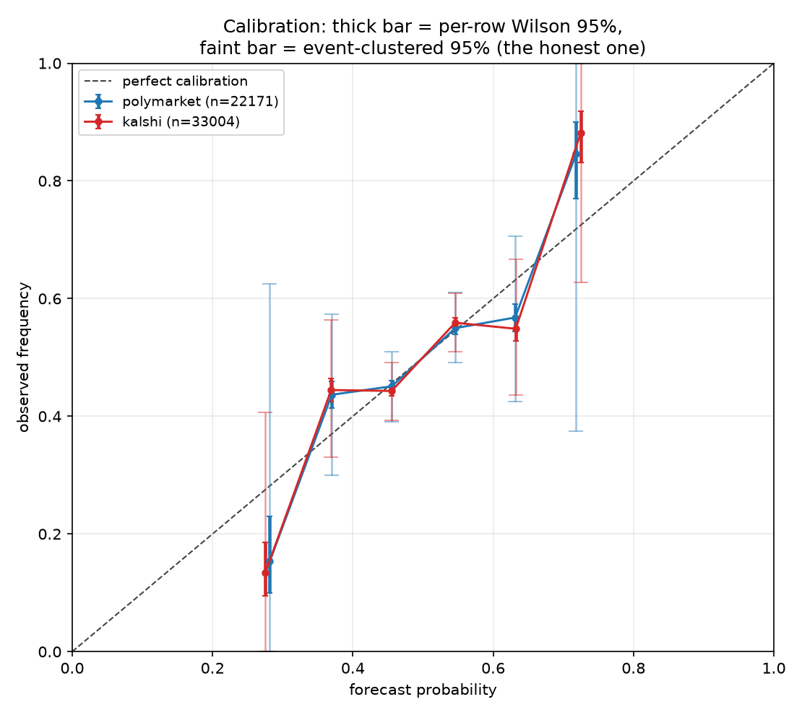
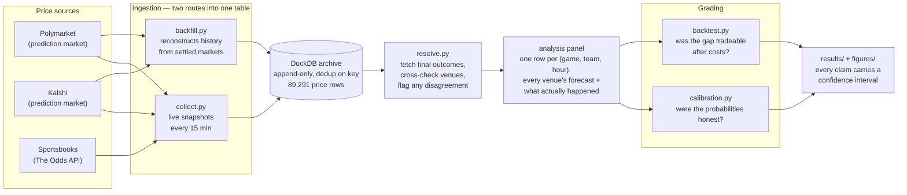
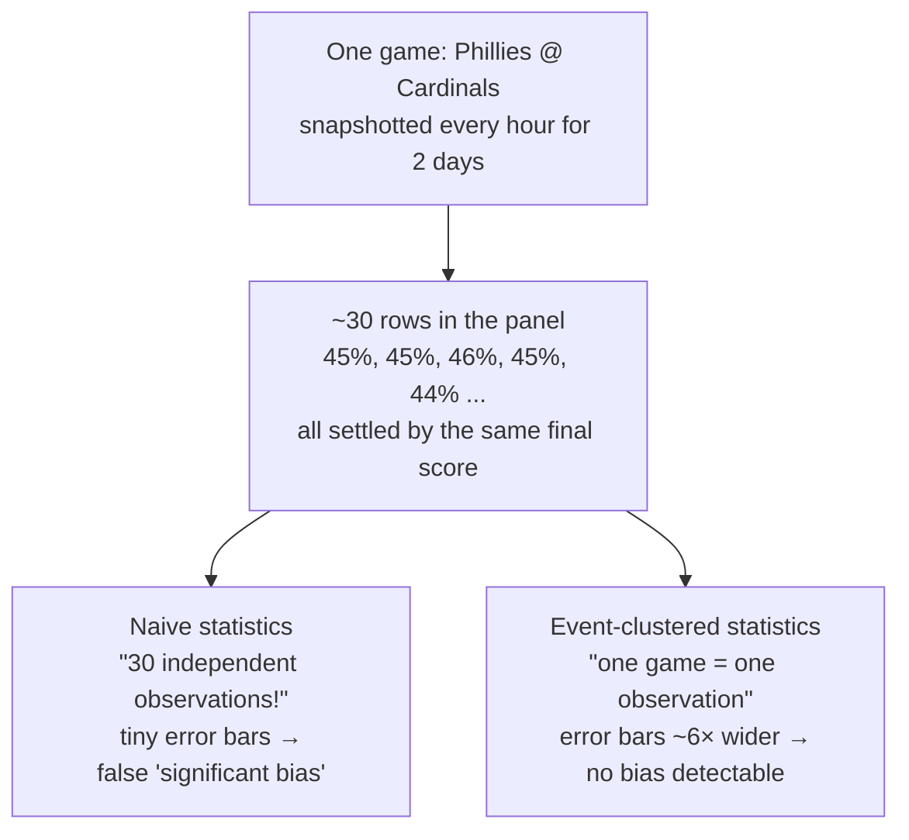
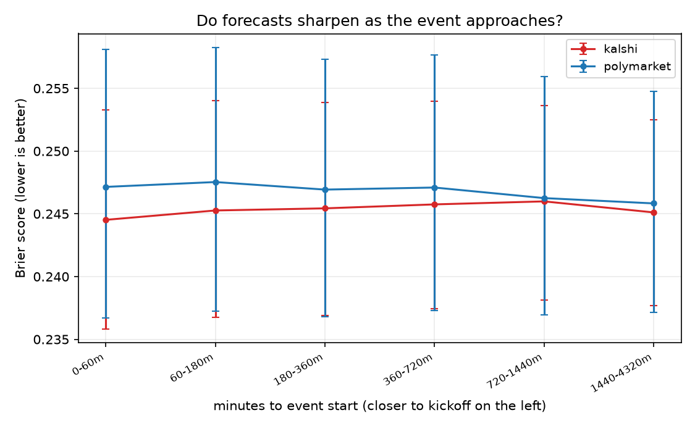

# pm-calibration

<!-- project-history -->
> **Provenance.** I started following prediction markets and sketching this study —
> reading, watching how the venues price the same games, and planning what a fair
> comparison would need — in early 2026. The codebase, data collection, and analysis in
> this repository were designed, built, and run in August 2026; the commit history is
> accurate and the commits are AI-pair-assisted (see the co-author trailers). Every
> number in this README is generated by the pipeline in `results/` and covered by the
> test suite, not typed in by hand.

**Are prediction markets better calibrated forecasters than sportsbooks, and is the gap between them tradeable after costs?**

[](https://github.com/crollila/pm-calibration/actions/workflows/ci.yml)
[](https://www.python.org/)
[](https://github.com/astral-sh/ruff)
[](tests/)
[](LICENSE)

This is a research repository, not a trading system. It places no orders and contains no
credentials for doing so. The deliverable is a defensible empirical answer with plots and
honest confidence intervals — including, quite possibly, the answer "no, and here is the
evidence that the apparent edge was spread, fees and correlated observations."

---

## TL;DR

Built an end-to-end pipeline — live collector, historical backfill, settlement reconciliation,
calibration analysis, cost-modelled backtest — and ran it on **89,291 price snapshots covering
351 MLB games** pulled from Polymarket and Kalshi.

**Two findings:**

**1. The venues are indistinguishable.** On 234 games with 21,733 paired hourly snapshots, the
paired Brier difference between Polymarket and Kalshi is **+0.00006, 95% CI [−0.00057,
+0.00070]**, clustered by event. Tight and centred on zero — not "cannot tell", but genuinely
the same prices.

**2. The favourite-longshot bias in this data is a statistical artifact.** Per-row Wilson
intervals say four of four reliability bins are significantly miscalibrated. Event-clustered
bootstrap intervals on the identical rows say none of them are. Clustering widens the bands
**~6×**, which is `sqrt(~30 snapshots per game)`. A version of this study that reported only
the naive intervals would have confidently published a bias that isn't there.



*Thick bars are per-row Wilson 95% intervals; faint bars are event-clustered 95% intervals on
the same data. The gap between them is the whole point.*

The backtest deliberately **did not run** — historical data carries no order-book depth, so no
honest fill can be simulated. "No data" and "no edge" are different claims and the pipeline
reports them differently. Details in [Tradeability](#tradeability-not-run-and-not-because-there-was-no-edge).

---

## Status

The live collector has not been running long enough to produce a sample, so the results
below come from **`backfill.py`**, which reconstructs history from settled markets. That
buys a usable dataset immediately at the cost of three things the live collector would
have given us, and those costs decide what can and cannot be claimed here:

- **No sportsbooks.** Historical odds are a paid endpoint and are deliberately skipped, so
  the headline question — *are prediction markets better calibrated than sportsbooks?* —
  **cannot be answered from this sample.** What can be answered is Polymarket vs Kalshi.
- **No order-book depth**, and no Polymarket bid/ask at all. The backtest therefore does
  not run. That is a hole in the data, not a finding of no edge, and it is reported as such.
- **Hourly, not 15-minute**, resolution: Kalshi's candlesticks come in 1/60/1440 minutes only.

Every number in [Results](#4-results) is generated by `analysis/run_all.py` into
`results/summary.md`. Nothing here is hand-typed from a model run.

---

## How it works, in plain English

A prediction market price **is** a probability: if a "Cardinals win" contract trades at
55¢ and pays $1 when they win, the market is saying 55%. Sportsbook odds encode the same
thing with a markup ("vig") stirred in. So every venue quoting a game is publishing a
forecast, whether it thinks of itself that way or not — and forecasts can be graded.

This repo does four things:

1. **Archives the forecasts.** Snapshot every venue's prices on a schedule, before anyone
   knows the outcome, into an append-only database.
2. **Learns the answers.** After each game settles, record who actually won — checked
   across venues, never trusted from just one.
3. **Grades the forecasts.** Across hundreds of games: when the market said 60%, did that
   side win about 60% of the time? A grader that says 60% and is right 60% of the time is
   *calibrated*.
4. **Asks if the disagreements were money.** When two venues price the same game
   differently, would buying the cheap one have profited *after* fees, the bid–ask spread,
   and the capital being locked up until the game ends?



On this sample the sportsbook lane and the backtest are switched off — historical odds are
a paid endpoint and historical data has no order-book depth — which is exactly what the
[Status](#status) section says. The pipes exist and are tested; the data to fill two of
them does not, yet.

---

## 1. Question

Prediction markets (Polymarket, Kalshi) and sportsbooks price the same events. Three
questions, in order, and the order matters:

1. **Calibration.** When a venue says 70%, does the event happen 70% of the time? Measured
   by Brier score with its Murphy decomposition, log loss, reliability curves, and the
   favourite-longshot regression.
2. **Sharpening.** Do forecasts improve as the event approaches, and does one venue
   improve faster? A venue that is only good at kickoff is not a better forecaster; it is
   a later one.
3. **Tradeability.** *Only if* a calibration gap exists: does it survive the spread, the
   fee schedule, the depth cap, and the fact that capital is locked until settlement?

Question 3 is asked last and is allowed to answer "no". The most likely honest outcome of
a study like this is that the venues are statistically indistinguishable and the visible
gap is eaten by costs. That is a result, and it is a more defensible one than a profit
claim, because it demonstrates knowing how edges evaporate.

**What this sample actually answers:** question 1 *between the two prediction markets*
(they are indistinguishable), and question 2 (neither sharpens measurably). The
prediction-market-versus-sportsbook comparison and question 3 are not answered here,
because historical sportsbook odds are paid and historical order-book depth does not
exist. Both need the live collector running.

## 2. Data

The sample analysed below was produced by:

```bash
uv run backfill.py --sport mlb --since 30d --rps 3
```

| | |
|---|---|
| Sources used | Polymarket Gamma + CLOB `prices-history`; Kalshi v2 `markets` + `candlesticks` |
| Sources available to the live collector | the above order books, plus The Odds API v4 (`h2h`, `us`, all books) |
| Sport | MLB (in season; NFL was in its off-season during this window) |
| Window | snapshots 2026-07-10 17:00 → 2026-08-11 01:00 UTC (32 days) |
| Cadence | hourly (backfill); the live collector runs every 15 minutes |
| Snapshot rows | **89,291** — 66,554 Kalshi, 22,737 Polymarket |
| Markets pulled | 242 Polymarket moneylines, 706 Kalshi game markets |
| Fetch errors | 0; all 948 markets recorded `status = 'ok'` |
| Endpoint used | `prices-history` 242/242, `candlesticks` 706/706, `/trades` fallback **0** |
| Analysis panel | 34,112 rows, **33,442 labelled**, 348 settled events |
| Both venues quoting + labelled | **21,733 rows across 234 events** — the paired sample |
| Settlement cross-checks | 468 (event, outcome) pairs settled by both venues, **0 conflicts** |

Two things worth recording about how that data was obtained, because both contradict
what the endpoints are commonly said to do:

- **The `prices-history` fidelity gotcha did not reproduce.** Resolved Polymarket markets
  returned dense series at 1-minute fidelity (2,881 points over a 2-day window). All 241
  markets were served by `prices-history`; the `/trades` fallback fired zero times. It is
  still implemented and every market's route is recorded in `backfill_progress.path`, so
  this is checkable rather than asserted.
- **Gamma returns HTTP 500 past an offset of roughly 1,500**, so a month cannot be paged
  directly. Discovery walks one day at a time to keep every page shallow.

Design decisions worth defending:

- **Raw payloads are stored verbatim** in `snapshots.raw_json`. Parsing is disposable; the
  dataset is the asset. Any field can be re-derived later without re-collecting.
- **Bid/ask, not midpoint.** Polymarket quotes come from the CLOB order book, not the
  Gamma midpoint, and Kalshi exposes both sides natively. A backtest that fills at the
  midpoint is the easiest way to invent an edge that does not exist.
- **Sportsbooks get a synthesised two-sided quote.** A book publishes one take-it price per
  outcome, so `ask_i = implied(price_i)` and `bid_i = 1 - sum(ask_j, j != i)`: backing every
  other outcome is economically the same as laying this one.
- **Append only, keyed on `(ts, venue, book, market_id, outcome)`.** Reruns are no-ops.
  A crash mid-run rolls back cleanly; every run is logged to `collection_runs` with row
  counts and error text, so uptime is provable from the database alone.
- **Venues are joined on team codes, not on names.** Kalshi names markets by city
  ("St. Louis"), Polymarket by full team name ("St. Louis Cardinals"), sportsbooks by full
  name again — free text cannot join them. But both venues embed team codes in structured
  identifiers (`mlb-stl-nyy-2026-08-03`, `KXMLBGAME-26AUG101945PHISTL-STL`), and those do.
  Everything funnels through one canonical code namespace in `pmcal/gamekeys.py`.

  Here is one real game arriving under three different names and landing on one key —
  this join is what makes every cross-venue number in this study possible:

  ```mermaid
  flowchart TD
      P["Polymarket<br/>&quot;Philadelphia Phillies vs. St. Louis Cardinals&quot;<br/>slug: mlb-phi-stl-2026-08-10"]
      K1["Kalshi, Phillies side<br/>&quot;Philadelphia vs St. Louis Winner?&quot;<br/>ticker: KXMLBGAME-26AUG101945PHISTL-PHI"]
      K2["Kalshi, Cardinals side<br/>same game, second contract<br/>ticker: KXMLBGAME-26AUG101945PHISTL-STL"]
      G["gamekeys.py<br/>parse slug / ticker,<br/>canonicalise team codes,<br/>normalise the date to US time"]
      KEY["one shared event key<br/>mlb · 2026-08-10 · phi~stl"]
      P --> G
      K1 --> G
      K2 --> G
      G --> KEY
  ```

  A market that cannot be parsed into exactly two known teams gets no key and drops out —
  the matcher refuses to guess. On this sample, 239 of 241 Polymarket games matched.
- **Matching is deliberately conservative.** A market that does not yield exactly two known
  teams and a start time gets `event_key = NULL` and drops out rather than being guessed at.

## 3. Method

### De-vigging (`devig.py`)

Three methods, one signature, no favourite: **multiplicative** (normalise to 1),
**additive** (subtract the overround equally), **Shin (1993)** (solve numerically for the
insider fraction `z`). All three are reported, because they disagree most on longshots —
exactly where the favourite-longshot bias lives.

The book reference is the **median across books** at each timestamp (median, not mean, so
one stale book cannot move it), with **Pinnacle tracked separately** as the sharp
benchmark. De-vigging happens *per book, before* aggregation: books carry different
margins, and the overround of an average is not the average overround.

### Calibration (`analysis/calibration.py`)

Brier with the full Murphy decomposition (reliability / resolution / uncertainty, plus the
binning `residual`, reported rather than hidden), log loss, Wilson-interval reliability
curves, the favourite-longshot regression with cluster-robust standard errors, and a Brier
profile across minutes-to-kickoff buckets.

### Clustering — the detail that decides whether any of this means anything

Every interval is bootstrapped over **10,000 resamples of whole events**, never of rows.
The two sides of a game are one observation seen twice, and snapshots 15 minutes apart are
not new information. Treating them as independent shrinks every standard error by roughly
`sqrt(rows per event)` and manufactures significance. `tests/test_stats.py` demonstrates
the effect directly: 20 copies of each observation widen a clustered interval by more than
3x relative to the naive one that believes them.

Venue comparisons are **paired** on the same events (`head_to_head`), which is strictly
more powerful than comparing two separately estimated Brier scores with overlapping CIs.

### Tradeability (`analysis/backtest.py`)

When the reference venue's fair probability exceeds the trade venue's **ask** by more than
`k`, buy at that ask. The cost model:

| Component | Treatment |
|---|---|
| Execution | far side of the book, always. Never the midpoint. |
| Kalshi taker fee | `ceil(0.07 x contracts x p x (1-p))`, rounded **up** to the cent |
| Polymarket taker fee | proportional to notional; rate is a config parameter (0.75%–1.80% tiers) |
| Slippage | fills capped at displayed top-of-book depth |
| Position count | one trade per (event, outcome) — 40 snapshots of one mispricing is one bet |
| Capital | locked from entry to settlement; reported as **return on capital-days** |

Reported: hit rate, predicted vs realised edge, Sharpe, max drawdown, return on
capital-days, the number of independent events the result rests on, and **closing line
value** — did the price come to us before kickoff? CLV does not depend on the outcome at
all, which makes it the cleanest evidence of real edge and the metric a desk asks for
first.

**The threshold sweep is published in full.** Reporting only the best `k` is p-hacking with
extra steps. A real edge decays smoothly across thresholds and rests on many events; a
spurious one spikes at one `k` on a handful.

### Five terms, in one breath each

| Term | Meaning |
|---|---|
| **Calibration** | When a forecaster says 70%, does it happen 70% of the time? That honesty, measured. |
| **Brier score** | The standard grade for probability forecasts: average of (forecast − outcome)². 0 is perfect; always guessing 50% on coin flips scores 0.25. Lower is better. |
| **Vig / overround** | The sportsbook's markup: their implied probabilities sum to ~105%, and the extra 5% is their cut. "De-vigging" strips it back out to recover the book's true opinion. |
| **Bid–ask spread** | You buy at the higher price and sell at the lower one; the gap is a real cost every trade pays. Backtests that pretend to trade at the midpoint invent free money. |
| **Favourite-longshot bias** | The classic finding that bettors overpay for longshots and underpay for favourites — so longshots win less often than their price implies. |

## 4. Results

All numbers below are from `results/summary.md`, generated by `uv run -m analysis.run_all
--n-boot 10000`. Intervals are 95% percentile bootstrap over **whole events**, 10,000
resamples.

### The headline: Polymarket and Kalshi are indistinguishable

> **On 234 MLB games (21,733 paired hourly snapshots), the paired Brier difference between
> Polymarket and Kalshi is +0.00006, 95% CI [−0.00057, +0.00070].** The interval is tight
> and centred on zero: this is not "underpowered, cannot tell" — on this sample the two
> venues price MLB moneylines the same way to within about seven basis points of Brier score.

| Venue | Rows | Events | Brier | 95% CI | Log loss | 95% CI |
|---|---:|---:|---:|---|---:|---|
| Polymarket | 22,171 | 236 | 0.24628 | [0.23721, 0.25550] | 0.68568 | [0.66709, 0.70456] |
| Kalshi | 33,004 | 346 | 0.24543 | [0.23782, 0.25310] | 0.68395 | [0.66825, 0.69963] |

Murphy decomposition (`reliability − resolution + uncertainty`):

| Venue | Reliability ↓ | Resolution ↑ | Uncertainty | Residual |
|---|---:|---:|---:|---:|
| Polymarket | 0.00085 | 0.00397 | 0.25000 | −0.00061 |
| Kalshi | 0.00135 | 0.00504 | 0.25000 | −0.00089 |

Both venues are **well calibrated but barely discriminating**. Reliability is near zero —
prices are honest. Resolution is only ~0.004–0.005 against an uncertainty of 0.25, i.e. the
forecasts explain about 2% of the outcome variance. That is not a criticism of the venues;
it is baseball. Their prices span only 0.245–0.755, and 84% of all snapshots sit between
0.40 and 0.60. A sport whose markets rarely leave coin-flip territory cannot produce a
high-resolution forecast, and Brier ≈ 0.245 is close to the best anyone could do.


### The clustering result, which is the methodological point of the repo

The intuition first, because it is simple and the mistake is everywhere. The pipeline
snapshots each game every hour for two days, so one game contributes ~30 rows — but those
rows are near-copies of each other, and both teams' rows are the same coin flip seen from
opposite sides. Statistics that treat every row as fresh evidence think the sample is
~30× bigger than it really is, and their error bars shrink accordingly:



The per-bin reliability curve looks like it shows significant miscalibration. It does not.
Under a per-row Wilson interval the 0.30–0.40 bin appears badly mispriced; under an
event-clustered bootstrap on the same rows it is unremarkable:

| Venue | Bin | Rows | Events | Forecast | Observed | Wilson 95% | Event-clustered 95% | Width |
|---|---|---:|---:|---:|---:|---|---|---:|
| Polymarket | 0.30–0.40 | 1,773 | 75 | 0.370 | 0.437 | [0.414, 0.460] | [0.300, 0.574] | **5.9×** |
| Polymarket | 0.60–0.70 | 1,703 | 71 | 0.631 | 0.568 | [0.544, 0.591] | [0.425, 0.706] | **6.0×** |
| Kalshi | 0.30–0.40 | 2,463 | 105 | 0.369 | 0.445 | [0.425, 0.464] | [0.330, 0.564] | **6.0×** |
| Kalshi | 0.60–0.70 | 2,373 | 98 | 0.632 | 0.549 | [0.529, 0.569] | [0.437, 0.667] | **5.8×** |

In every one of those bins the Wilson interval **excludes** the forecast probability — a
textbook favourite-longshot finding, significant at a glance — and in every one the
clustered interval **contains** it comfortably. Clustering widens the bands by a factor of
about six, almost exactly the `sqrt(rows per event)` ≈ `sqrt(24…33)` you would predict from
24–33 hourly snapshots per game.

**The entire apparent favourite-longshot signal in this dataset is an artifact of counting
one game as thirty observations.** If this study reported only the Wilson bands it would
claim a significant bias in both venues, and it would be wrong. The plot draws both bars
for exactly this reason: thick is naive, faint is honest.

### Favourite-longshot regression

| Venue | Slope | SE | 95% CI | Intercept | 95% CI |
|---|---:|---:|---|---:|---|
| Polymarket | 0.831 | 0.415 | [0.014, 1.649] | 0.084 | [−0.324, 0.493] |
| Kalshi | 0.904 | 0.342 | [0.232, 1.576] | 0.048 | [−0.288, 0.384] |

Both slopes sit below 1, the classic direction, and neither is distinguishable from 1 — or
from 0.5, or from 1.5. **This sample cannot test the favourite-longshot hypothesis**, and
the reason is structural rather than bad luck: the regressor spans 0.245–0.755, so there is
almost no leverage at the extremes where the bias is supposed to live. Testing FLB needs a
sport with genuine longshots — NFL spreads, or better, multi-way markets.

### Sharpening: no detectable improvement approaching first pitch



Brier by time-to-event bucket is flat for both venues across the 48 hours before first
pitch — Polymarket 0.2458 (24–72h) → 0.2471 (0–60m), Kalshi 0.2451 → 0.2445 — with heavily
overlapping intervals throughout. Neither venue sharpens, and neither leads the other. If
anything Polymarket drifts very slightly *worse* approaching first pitch, but the movement
is far inside the noise. Two caveats keep this from being a strong claim: the backfill only reaches 48 hours
back, and hourly sampling cannot see the last-hour lineup and weather news that would move
a baseball market most.

### Tradeability: not run, and not because there was no edge

The backtest did not execute. `run_all` reports the blockers rather than printing zero
trades, because "no data" and "no edge" are different claims:

- **Polymarket**: no executable ask price — `prices-history` returns a price series with no
  order book.
- **Kalshi**: has a genuine bid/ask from candlesticks, but **no top-of-book depth**, so
  fills cannot be capped at displayed size.
- **Both**: no book consensus to diverge from, since sportsbook history was skipped.

A backtest could have been produced by assuming a fill size. It would have been fiction.
The live collector exists precisely to capture the depth that history does not retain, and
this is the concrete argument for running it.

### De-vig methods

Not exercised: with no sportsbook data there is no vig to remove. The three methods and the
Shin ≡ additive identity remain verified by unit test rather than by this sample.

### Settlement cross-check

468 (event, outcome) pairs were settled independently by both Polymarket and Kalshi.
**They agreed on all 468; `resolution_conflicts` is empty.** Worth stating plainly because
an earlier run of this pipeline reported zero conflicts while only one venue was actually
resolving — see [Limitations](#6-limitations). Zero conflicts is only meaningful once you
have checked that two venues really answered.

### Figures

| Figure | File |
|---|---|
| Calibration curves, both interval flavours | `figures/calibration_curve.png` |
| Calibration error by bin | `figures/reliability_residuals.png` |
| Brier by time-to-kickoff bucket | `figures/sharpening.png` |
| Optimal stake vs estimate noise | `figures/kelly_uncertainty.png` |
| De-vig disagreement (empty — no book data) | `figures/devig_disagreement.png` |

## 5. Results that do not depend on the sample

These are properties of the instruments and the estimators, verified in the test suite
today. They frame how to read whatever the data says.

**Shin and additive de-vig are the same number on any two-outcome market.** Not
approximately — identically. Shin's relation is `pi_i = sqrt(Pi * p_i * ((1-z) p_i + z))`;
the additive solution satisfies it for *every* `z`, with `z` merely adjusting to fit the
overround (proof in the `devig.py` module docstring, checked numerically in
`tests/test_devig.py`). So for h2h sports markets the only live comparison is
multiplicative against the other two; the three methods genuinely separate only on
three-or-more-way markets. Anyone reporting "Shin vs additive" on two-way football markets
is reporting rounding error.

**Kalshi's fee is a wall in the middle of the book.** `ceil(0.07 C p (1-p))` costs **1.75
probability points** on a coin-flip market and 0.63 points at p=0.90. It is not
proportional to notional; it peaks where most sports markets trade. A 2-point cross-venue
divergence at p=0.5 is a break-even trade *before* the spread.

**Full Kelly is wrong here, but not for the usual reason.** The common claim — "p is
uncertain, so bet less" — is false, and `analysis/kelly.py` computes the counterexample:
log growth is *affine* in `p`, so averaging over a noisy `p` just substitutes its mean. The
two things that are true:

1. The estimate error never averages out, because the same `p_hat` is reused on every bet.
   Realised growth is affine in the true `p` with slope `s(f)` that increases with stake,
   so a bigger position linearly amplifies a permanent tilt. Penalising that variance gives
   an interior optimum that is *exactly* full Kelly on a shrunk probability `p_hat - k*sigma`.
   **Fractional Kelly is estimate shrinkage**, and the fraction should scale with the
   standard error of the estimate.
2. The penalty is violently asymmetric: half Kelly keeps ~75% of the growth rate, double
   Kelly keeps **none** of it. When unsure which side of the peak you are on, the cheap
   side is the low one.

## 6. Limitations

- **Event matching is structural but not infallible.** Team codes out of slugs and tickers
  are far stronger than free-text matching, and 239 of 241 events matched here. But the key
  is `sport|date|teamA~teamB`, so a **doubleheader** — two games between the same teams on
  the same day — collapses into a single `event_key` and one of the two games is lost. MLB
  plays them. This sample makes no attempt to split them, and that is a real, if small,
  source of dropped events.
- **Kalshi's ticker timestamp is assumed to be US Eastern** and converted with a fixed
  4-hour offset. That is right in August and an hour off in winter. It cannot change the
  US calendar date for any normal start time, but it would matter for a sport played near
  midnight local.
- **Kalshi's kickoff time is a proxy.** We store `close_time`; `resolve.py` prefers the
  Odds API `commence_time` when the event is matched, and only from the moment it is
  actually observed (see the no-lookahead note below).
- **Sportsbook depth is unknown.** Books publish no size, so the backtest only ever
  *executes* on the prediction-market side and uses the book purely as a reference. Any
  strategy requiring a book fill is outside what this data can honestly simulate.
- **The Murphy decomposition is bin-dependent.** The identity is exact only when every
  forecast in a bin is identical; `residual` reports the binning error rather than hiding it.
- **The Sharpe annualisation is an assumption**, stated explicitly: per-trade ROI is not a
  time series, so it is scaled by `sqrt(365 / mean_hold_days)`, i.e. assuming capital
  recycles once per holding period. Return on capital-days is the primary metric precisely
  because it needs no such assumption.
- **Settlement conflicts are dropped, not adjudicated.** Where venues disagree and no
  majority exists, the label is NULL and the row leaves the sample. This is the honest
  choice, but it is also a non-random exclusion: disputed games are probably unusual games.
- **Survivorship in the market universe.** We collect open markets; a market delisted
  between snapshots simply stops appearing. `collection_runs` makes the gaps visible.
- **One-way trading only.** No shorting: the mirror contract is a different instrument with
  its own spread and fee.

### Limitations specific to the backfilled sample

- **One sport, 32 days, 234 shared events.** MLB in August. Nothing here generalises to
  NFL, to other seasons, or to non-sports markets. It is a single slice.
- **Backfill selects on settlement.** Only markets that reached a settled state are pulled,
  so a market that was voided, delisted, or is still disputed never enters the sample. The
  live collector, which snapshots whatever is open at the time, does not have this bias.
- **Hourly, and only 48 hours deep.** Kalshi's candlesticks come in 1/60/1440-minute
  intervals, so the panel is hourly rather than the collector's 15 minutes. Any sharpening
  concentrated in the final hour is invisible at this resolution.
- **Per-bin Wilson intervals are reported but should not be believed on their own.** They
  assume independent rows; the rows are not independent. The clustered interval alongside
  them is the one to read — see the [clustering result](#the-clustering-result-which-is-the-methodological-point-of-the-repo).
- **A silent API failure cost a full settlement run.** Gamma's `/markets?id=…` filter
  answers HTTP 200 with an empty list instead of an error, so Polymarket settlement
  resolved nothing while looking perfectly healthy — and because only Kalshi was answering,
  `resolution_conflicts` was empty for the wrong reason. Fixed by fetching `/markets/{id}`
  and counting misses out loud. The lesson generalises: a cross-check that reports no
  conflicts is worthless until you have confirmed both sides actually replied.

### No lookahead, asserted rather than assumed

Any feature at time T uses only data available at T, and `tests/test_no_lookahead.py`
enforces it by rebuilding the panel from truncated data and requiring every row at or
before T to be identical. This caught a real bug during development: the panel originally
took the best kickoff time over the *whole* history, so a book quote arriving at 18:00
would retroactively correct `minutes_to_start` on a 12:00 row. It is now computed as-of.

## 7. What I would do with more time

In priority order, given what this sample could and could not settle:

- **Run the live collector for a season.** It is the only route to the two things the
  backfill structurally cannot give: sportsbook prices and order-book depth. Without them
  the headline question stays open and no backtest is honest. Everything else is secondary.
- **Pay for one month of historical odds** as a bridge. The Odds API `/v4/historical`
  endpoint would let the venue-vs-book comparison run on the 234 games already collected,
  instead of waiting for new ones.
- **Pick a sport with real longshots.** MLB moneylines span 0.245–0.755, which is why the
  favourite-longshot slope has a CI of [0.01, 1.65]. NFL, or a multi-way market, would give
  the regressor the leverage it needs — and would also make the three de-vig methods
  actually diverge, since on two-way markets Shin and additive are identical.
- **Split doubleheaders.** The `event_key` is date-based, so two games between the same
  teams on the same day collapse into one. Adding the start time to the key would fix it
  and recover the handful of events currently lost.
- **Order-book depth beyond level one.** Top-of-book caps fills but understates a patient
  execution; a full-depth walk would separate "no edge" from "no size".
- **Maker rather than taker.** Both venues charge nothing to make on Polymarket and less to
  make on Kalshi. Half of this study's cost model exists because we assume we cross.
- **Intraday news alignment.** Sharpening is currently measured against the clock. Measured
  against injury-report timestamps it would say something about *why* one venue leads.
- **A proper Bayesian hierarchical calibration model** — partial pooling across sports —
  instead of independent per-bucket estimates, which would use the thin buckets better.
- **Extend to non-sports markets**, where prediction markets have no sportsbook competitor
  and calibration is the only question that can be asked.
- **Cross-venue settlement conflicts as their own paper.** They are currently a side
  table; a venue that settles a game differently from its competitor is genuinely interesting.

---

## Reproduction

Requires Python 3.11+ and [`uv`](https://docs.astral.sh/uv/).

```bash
git clone <this repo> && cd pm-calibration
```

```bash
uv sync
```

```bash
cp .env.example .env   # add ODDS_API_KEY; Polymarket and Kalshi need no auth
```

Check the collectors without writing anything:

```bash
uv run collect.py --dry-run
```

Collect one snapshot:

```bash
uv run collect.py
```

Or reconstruct history instead of waiting weeks for the collector. Check the scope first:

```bash
uv run backfill.py --sport mlb --since 30d --dry-run
```

Then pull it. The job is resumable — every market is ledgered in `backfill_progress`, so an
interrupted run picks up where it stopped and a rerun writes nothing new:

```bash
uv run backfill.py --sport mlb --since 30d --rps 3
```

Kalshi returns HTTP 429 above roughly 4 requests/second. Failures are recorded rather than
retried forever; simply run the same command again to sweep them up.

Settle finished events and rebuild the analysis panel:

```bash
uv run resolve.py --with-scores
```

Run the full analysis (writes `results/` and `figures/`):

```bash
uv run -m analysis.run_all --n-boot 10000
```

The exact sequence that produced the results in this README, from an empty database:

```bash
uv run backfill.py --sport mlb --since 30d --rps 3 && uv run resolve.py --max-markets 2000 && uv run -m analysis.run_all --n-boot 10000
```

Tests and lint:

```bash
uv run pytest && uv run ruff check .
```

### Running the collector on a schedule

Every 15 minutes via cron:

```bash
*/15 * * * * cd /opt/pm-calibration && /usr/local/bin/uv run --frozen collect.py --bucket-minutes 15 >> /var/log/pm-collect.log 2>&1
```

Or with systemd (units in `deploy/`), which is preferred because `Persistent=true` picks up
a window missed by a reboot:

```bash
sudo cp deploy/pm-*.service deploy/pm-*.timer /etc/systemd/system/ && sudo systemctl daemon-reload && sudo systemctl enable --now pm-collect.timer pm-resolve.timer
```

Prove uptime from the database itself:

```bash
uv run python -c "import duckdb;print(duckdb.connect('data/pm_calibration.duckdb').execute(\"SELECT source, status, count(*) n, sum(rows_inserted) rows FROM collection_runs GROUP BY 1,2 ORDER BY 1,2\").df())"
```

---

## Data dictionary

### `snapshots` — one row per (ts, venue, book, market_id, outcome)

| Column | Type | Notes |
|---|---|---|
| `ts` | TIMESTAMP | Snapshot bucket, UTC, floored to the collection interval. Part of the primary key. |
| `venue` | VARCHAR | `polymarket`, `kalshi`, or `sportsbook`. |
| `book` | VARCHAR | Bookmaker key (`pinnacle`, `draftkings`, …); empty string for prediction markets. |
| `market_id` | VARCHAR | Venue-native id. Kalshi is `TICKER:yes` / `TICKER:no`; sportsbooks are `eventId:h2h`. |
| `outcome` | VARCHAR | Normalised outcome label (team nickname where derivable). |
| `event_key` | VARCHAR | Cross-venue join key, `sport\|us-date\|team~team`. NULL when matching was not confident. |
| `sport` | VARCHAR | `nfl`, `nba`, `mlb`, … NULL for non-sports markets. |
| `title` | VARCHAR | Venue's own market title, kept for auditing the matcher. |
| `bid`, `ask` | DOUBLE | Probability units 0–1. For sportsbooks, `ask` is the raw implied price and `bid` is the synthetic lay (see Data). |
| `mid` | DOUBLE | Midpoint; falls back to the venue's last/quoted price when one side is missing. |
| `bid_size`, `ask_size` | DOUBLE | Top-of-book depth in contracts. NULL for sportsbooks (not published). |
| `volume` | DOUBLE | Venue-reported volume; units are **not** comparable across venues. |
| `event_start_time` | TIMESTAMP | Scheduled start as that venue reports it (a proxy for Kalshi). |
| `collected_at` | TIMESTAMP | Wall-clock time of the actual fetch, as opposed to the bucket. |
| `run_id` | VARCHAR | Joins to `collection_runs`. |
| `raw_json` | VARCHAR | Full upstream payload, verbatim. |

`source` distinguishes **`live`** (sampled at `ts` by `collect.py`) from **`backfill`**
(reconstructed after the fact by `backfill.py`). The two differ in what they can carry, and
the difference matters for analysis:

| | `live` | `backfill` |
|---|---|---|
| Polymarket bid/ask | CLOB order book | **absent** — `prices-history` returns price only |
| Kalshi bid/ask | order book | candlestick `yes_bid` / `yes_ask` |
| Top-of-book depth | both venues | **absent** on both |
| Sportsbooks | all `us` books | **absent** — paid historical endpoint, deliberately skipped |
| Cadence | 15 min | 60 min (Kalshi candles come in 1/60/1440 only) |

The primary key does not include `source`, so a live row and a backfilled row for the same
`(ts, venue, book, market_id, outcome)` collapse to whichever landed first. That is the
intended append-only behaviour: the first observation of a price wins.

### `backfill_progress` — one row per (venue, market_id)

`status` (`ok` / `empty` / `error`), `path` (which historical endpoint served it),
`rows_written`, `updated_at`, `note`. This is the resume ledger: `ok` and `empty` markets
are skipped on the next run, `error` ones are retried. `path` is also the audit trail for
which Polymarket markets needed the trades fallback rather than `prices-history`.

### `collection_runs` — one row per (run_id, source)

`run_id`, `source`, `started_at`, `finished_at`, `status` (`running` / `ok` / `error`),
`rows_seen`, `rows_inserted`, `dry_run`, `error`. A row stuck at `running` is a crashed
run; that is the point of writing it before the fetch.

### `resolutions` — one row per (venue, market_id, outcome)

`event_key`, `resolved` (1.0 / 0.0 / NULL when not yet settled), `status`, `resolved_at`,
`observed_at`, `raw_json`. Upserted, because a market legitimately moves from open to
settled.

### `resolution_conflicts` — one row per disagreeing venue pair

`event_key`, `outcome`, `venue_a`, `value_a`, `venue_b`, `value_b`, `detected_at`, `note`.
Conflicts are recorded, never silently resolved.

### `analysis_panel` — one row per (event_key, outcome, ts), pre-kickoff only

| Column | Notes |
|---|---|
| `minutes_to_start` | Always > 0; post-kickoff quotes are a different (live-betting) problem. |
| `pm_*`, `kalshi_*` | Top-of-book bid/ask/mid and depth per prediction market. |
| `book_multiplicative`, `book_additive`, `book_shin` | Median-across-books fair probability, one column per de-vig method. |
| `pinnacle_*` | Same three methods, Pinnacle alone. |
| `n_books` | How many books quoted this event at this timestamp. |
| `y` | Realised outcome, 1.0 / 0.0, NULL when venues conflict with no majority. |
| `y_agreement` | Fraction of settling venues that agreed. 1.0 is unanimous. |

## Repository layout

```
collect.py              snapshot daemon (live, forward-looking collection)
backfill.py             reconstruct history from settled markets
resolve.py              settlement, conflict detection, panel rebuild
devig.py                three de-vig methods + the Shin solver
pmcal/
  config.py  db.py  http.py  util.py
  odds.py               American <-> decimal <-> implied
  fees.py               Kalshi and Polymarket taker fee models
  teams.py              team code -> aliases, per sport
  gamekeys.py           slug/ticker parsing, canonical event_key + outcome codes
  matching.py           free-text nickname extraction, US date bucketing
  consensus.py          per-book de-vig -> median consensus + Pinnacle
  panel.py              tidy analysis panel, ground truth, conflicts
  stats.py              Wilson, clustered bootstrap, cluster-robust OLS
  sources/              polymarket.py  kalshi.py  oddsapi.py       (live)
                        polymarket_history.py  kalshi_history.py   (backfill)
analysis/
  calibration.py  backtest.py  kelly.py  plots.py  run_all.py
tests/                  odds, de-vig, fees, no-lookahead, db, stats, panel,
                        backtest, gamekeys, backfill, resolve, doctests
deploy/                 systemd units and timers
```

Every module is under 300 lines and there are no class hierarchies; the only classes are
two frozen config dataclasses.
